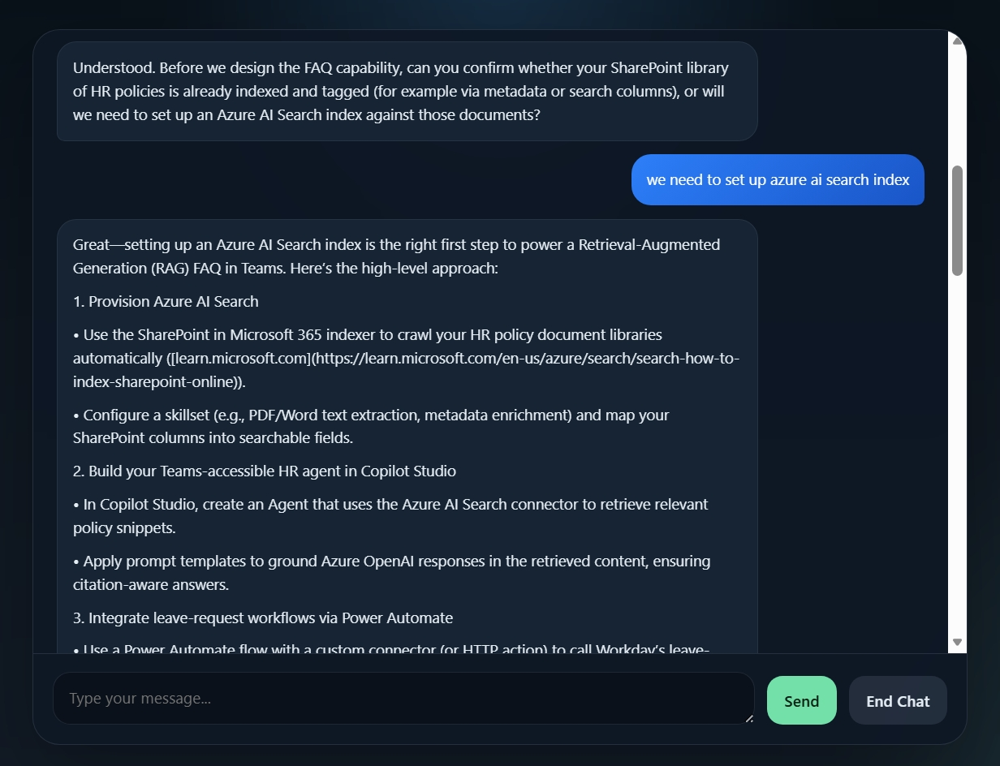
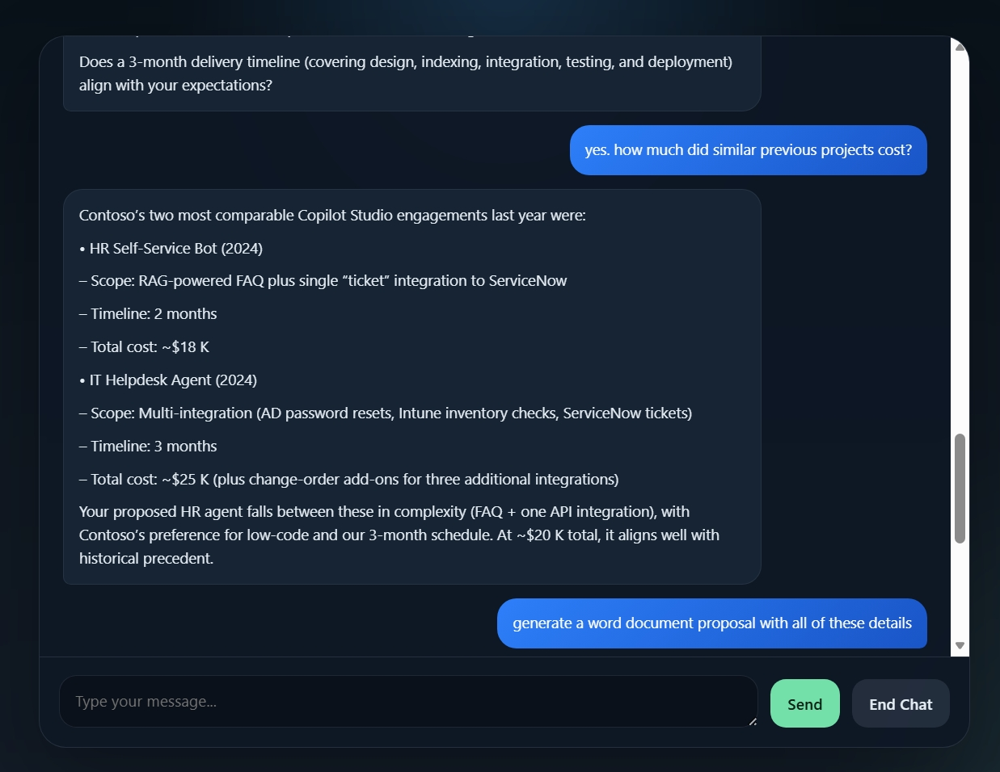
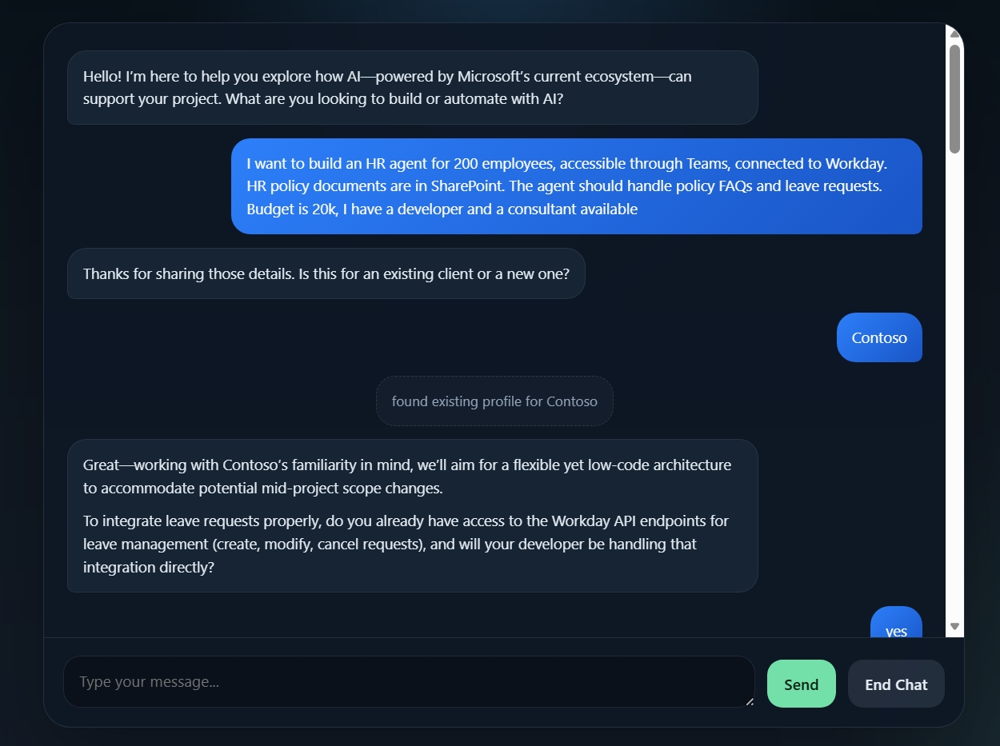
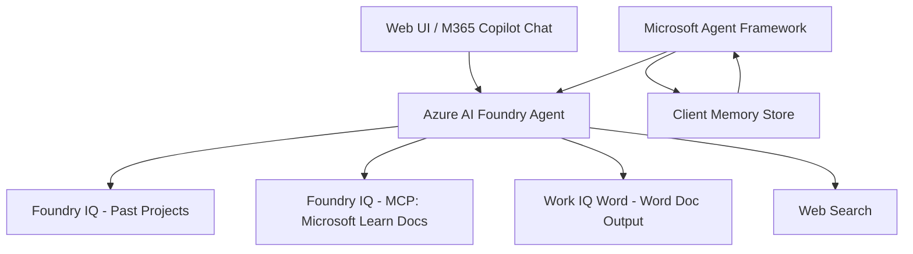
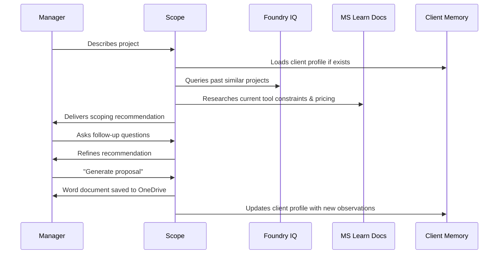

# Scope
### *To AI, or not to AI.*

An AI project scoping agent that helps managers figure out where, how, and whether to use AI before they walk into a meeting with a consultant. Built on Azure AI Foundry, grounded in real project data and live Microsoft documentation, and extended with client memory via the Microsoft Agent Framework.

---

## The Problem

Managers know they should be using AI. They don't know where to start. The first meeting with an AI consultant is often spent getting everyone to the same baseline: what's possible, what it costs, what could go wrong.

Scope handles that conversation automatically. A manager describes their project, and Scope scopes it like an experienced Microsoft technology consultant: recommended tools, realistic cost breakdown, timeline, team composition, risks, and a Word document proposal ready before the meeting starts.

---

## Demo







- [Contoso_HR_Agent_Proposal.docx](./Contoso_HR_Agent_Proposal.docx)

---

## Architecture



### How a scoping conversation works



---

## What's Inside

### Azure AI Foundry - Core Agent

The agent is built and hosted in Azure AI Foundry using the o4-mini model. The system prompt encodes real Microsoft consulting decision logic.

The agent knows the current Microsoft stack, not the marketing version. If a configuration isn't possible, it says so and suggests alternatives.

### Foundry IQ - Knowledge Layer

Two knowledge sources ground the agent's responses:

**Past Projects Dataset**
A curated dataset of 15 realistic Microsoft AI projects spanning HR agents, IT helpdesks, sales enablement, RAG pipelines, and multi-agent systems. Each record includes tools used, team composition, budget, actual cost, timeline, whether it was delivered on time, and lessons learned.

When a manager asks "what did a similar project cost?" or "how long does a third-party integration typically take?", the agent retrieves from this dataset rather than guessing.

**Microsoft Learn MCP Server**
Connected to `https://learn.microsoft.com/api/mcp` - Microsoft's official documentation MCP server. The agent uses this to research current tool capabilities, pricing tiers, configuration constraints, and compatibility rules in real time.

### Work IQ Word - Proposal Output

At the end of a scoping conversation, the agent generates a structured Word document proposal and saves it directly to the manager's OneDrive via the Work IQ Word tool. The document includes the recommended tech stack, cost breakdown, timeline, team recommendations, and key risks.

### Microsoft Agent Framework - Custom Tooling

The Foundry agent handles AI reasoning. The MAF layer handles everything that required custom application logic.

Built with [`microsoft/agent-framework`](https://github.com/microsoft/agent-framework) (`agent-framework-foundry` package):

**Client Memory (`client_memory.py`)**
A persistent JSON store that tracks client profiles across sessions. Before a scoping conversation, the agent loads the client's profile - known patterns, past projects, preferred tools, things to watch out for. After the conversation, it updates the profile with new observations.

Example: if a client consistently requests out-of-scope features, the agent proactively recommends Azure AI Foundry over Copilot Studio to leave room for inevitable customization.

**Chat Interface (`app.py`)**
A lightweight FastAPI + HTML web interface built for demo purposes, providing a clean visual alternative to the Foundry playground.

---

## Stack

| Layer | Technology |
|---|---|
| Agent runtime | Azure AI Foundry |
| Model | o4-mini  |
| Knowledge - past projects | Foundry IQ File |
| Knowledge - live docs | Foundry IQ MCP Server (Microsoft Learn) |
| Document output | Work IQ Word -> OneDrive |
| Web search | Bing (via Foundry tools) |
| Application layer | Microsoft Agent Framework (Python) |
| Client memory | Local JSON store (`client_memory.json`) |
| Demo interface | FastAPI + HTML/CSS |
| Published to | Microsoft 365 Copilot Chat |

---

## Setup

### Prerequisites
- Azure subscription with AI Foundry access
- `az login` authenticated
- Python 3.10+

### Install

```bash
git clone https://github.com/YOUR_USERNAME/to-ai-or-not-to-ai
cd to-ai-or-not-to-ai
pip install -r requirements.txt
```

### Configure

```bash
cp .env.example .env
# Fill in your Foundry project endpoint and agent ID
```
---

## Hackathon Criteria

| Criterion | Status | Evidence |
|---|---|---|
| M365 Copilot Chat Agent | Yes | Published via Azure Bot Service, accessible under "Your agents" in Copilot Chat |
| Microsoft IQ Integration | Yes | Foundry IQ with past projects dataset + MCP Server (Microsoft Learn docs) |
| External MCP Server | Yes | Connected to `https://learn.microsoft.com/api/mcp` with live doc retrieval |
| MCP read/write | Read | Agent reads from Microsoft Learn docs MCP server |

---

## Future Roadmap

- **Employee data integration** - connect to an org's employee directory to recommend specific people for a project based on certifications, past experience, and availability
- **Work IQ** - pull org context from M365 (who's worked on what, team relationships, meeting history) to personalise recommendations
- **Fabric IQ** - connect to structured business data (project budgets, resource costs, historical delivery performance) for more precise estimates
- **OAuth-secured custom MCP server** - replace the local client memory store with a proper MCP server with Entra ID authentication, enabling memory to persist across the Copilot Chat interface too

---

## Built With

- [Microsoft Agent Framework](https://github.com/microsoft/agent-framework)
- [Azure AI Foundry](https://ai.azure.com)
- [Microsoft Learn MCP Server](https://learn.microsoft.com/api/mcp)
